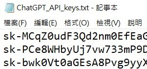
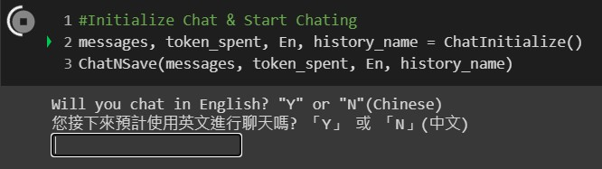

# OpenAI-convenient-chatBOT

This project is a Colab notebook that integrates with the ChatGPT-3.5 API to act as a chatbot, which is not only convenient but also useful. The notebook includes built-in keywords in both English and Chinese that you can select to quickly start a chat. Chat records will be saved in "docx" format and stored in the your Google Drive folder at `/content/drive/MyDrive/Colab Notebooks/ChatGPT_API` (It'll be build if the folder isn't exsist). File name are automatically generated by the chatbot. If there're existing chat records in the folder, it can read them and continue the conversation seamlessly.

## Preparison

To use this project, you need a Google account for accessing to your Google Drive, along with one (or more) ChatGPT-3.5 API key stored row by row in a txt named `ChatGPT_API_keys.txt` in any folder of your Google Drive.

  
   
  <em>▲ Example of ChatGPT_API_keys.txt ▲</em>
   

:bell: You can obtain your ChatGPT-3.5 API keys form [HERE](https://platform.openai.com/account/api-keys)

## Installation

There is **NO** installation required for this project. (Precisely, installations will be processed in Colab notebook).

**Just open the Colab notebook** and run the code from top to bottom by clicking play buttons on the left side! 
Or you can press Ctrl+F9 to do so if you're not willing to find play buttons or click them one by one.

  
   
  <em>▲ play button ▲</em>
   

## How to Use after Running the Code?

1. Authorize the notebook to access your Google Drive while the pop-up window appears.

  
   
  <em>▲ Click "Connect to Google Drive" of the pop-up window ▲</em>
   
  
   
  <em>▲ Then choose your account ▲</em>
   
  
   
  <em>▲ Finally scroll the scrollbar to the bottom and click "Allow"▲</em>
   

2. Scroll the scrollbar to the bottom directly and patiently wait for something being printed under the code.

  
   
  <em>▲ wait for this ▲</em>
   

3. After selecting the language you're going to use mainly, please decide whether to use prepared prompts.

  
   
  <em>▲ A null chat will begin if "N" is entered. ▲</em>
   

3. Select a keyword to start the chat.
4. Follow the prompts to continue the conversation.
5. When you're finished chatting, the chat record will be saved as a docx file in your Google Drive folder.

## Problems You May Encount

1. Open the Colab notebook.
2. 
　
 　
　
 
 
　　
　
　
### :star: If this project is helpful to you or your projects, please help star this repo. Thanks! :hugs:
