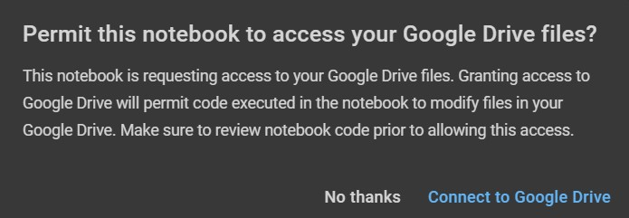

# OpenAI-convenient-chatBOT

This project is a Colab notebook that integrates with the ChatGPT-3.5 API to act as a chatBOT, which is not only convenient but also useful. The notebook includes built-in keywords in both English and Chinese that you can select to quickly start a chat. Chat records will be saved in "docx" format and stored in the your Google Drive folder, which makes it easier to read when not login in . If there're existing chat records in the folder, they'll be listed for you to choose and continue the conversation seamlessly. And what's more, you can even send your chat records toward friends to read or to continue your conversation seamlessly. 

 ㅤ
### :star: If this project is helpful to you, please help star this repo. Thanks! :hugs:
 ㅤ
## Preparison

To use this project, please copy your ChatGPT API key first. Otherwise, you need a Google account for accessing to your Google Drive, along with one (or more) ChatGPT-3.5 API keys stored row by row in a txt named `ChatGPT_API_keys.txt` in any folder of your Google Drive.

 ㅤ

  
   
  <em>▲ Example of ChatGPT_API_keys.txt ▲</em>
   

 ㅤ
 
:bell: You can obtain your ChatGPT-3.5 API keys form [HERE](https://platform.openai.com/account/api-keys)

 ㅤ
## Installation

There is **NO** installation required for this project. (Precisely, installations will be processed in Colab notebook).

**Just open the Colab notebook** and run the code from top to bottom by clicking play buttons on the left side one by one! 
 ㅤ

  
   
  <em>▲ Play buttons on the left side▲</em>
   

 ㅤ
 
## How to Use after Running the Code?
##### :warning: Parameters IN a cell must be set before running the cell, whereas those BELOW a cell don't. :warning:

 ㅤ
 
1. Change `language`  to "CN" if you need a Chinese UI

 ㅤ

  
   
  <em>▲ You can change language here ▲</em>
   

 ㅤ
 
2. Authorize the notebook to access your Google Drive while the pop-up window appears.

 ㅤ

  
   
  <em>▲ Click "Connect to Google Drive" of the pop-up window ▲</em>
   
  
   
  <em>▲ Then choose your account ▲</em>
   
  
   
  <em>▲ Finally scroll the scrollbar to the bottom and click "Allow"▲</em>
   

 ㅤ
 
 ㅤ:bell: You can skip this step if you have a ChatGPT API key that you sure it works.

 ㅤ

  
   
  <em>▲ Paste your ChatGPT API key to skip this step ▲</em>
   

 ㅤ
 
3. Scroll the scrollbar to the bottom directly and patiently wait for something being printed under the code.

 ㅤ

  
   
  <em>▲ Wait for this (A null chat will begin if "N" is entered here) ▲</em>
   

 ㅤ
 
4. If "Y" was entered at previos step, you'll see Quick Start List. Please enter the number of the prompt you like then to start the chat quickly & conveniently.

  
   
  <em>▲ If neither a number nor "N"/"P"/"Q" is entered, Quick Start List will turn into Search Results of what you enter ▲</em>
   

 ㅤ
 
 ㅤ:bell: "N"/"P" for next/previous page or "Q" to quit

 ㅤ
 
 ㅤ
5.Set parameters if neccesary.

 ㅤ

  
   
  <em>▲ Some of prepared prompt contains parameter supposed to be replace ▲</em>
   

 ㅤ
 
6. Wait for the answer and continue chatting.

 ㅤ
 
7. Enter "Q" merely if you don't wanna chat anymore and then the number of tokens of ChatGPT API you spent in this chat will show up.

 ㅤ
 
8. When you're finished chatting, the chat record will be saved with your consent as a docx file in your Google Drive folder(`/content/drive/MyDrive/Colab Notebooks/ChatGPT_API`) , which will be built if not exsist.

 ㅤ

  
   
  <em>▲ File name is named automatically by the chatBOT ▲</em>
   

 ㅤ
 
:bell: Once that folder contains any chat record, list of recorded chats named "【History】" will appear firstly for selecting before the query of the language you're going to use.

 ㅤ

  
   
  <em>▲ Enter the number of recorded chat to continue or "Q" to start a new one ▲</em>
   

 ㅤ
 
## FAQ
 ㅤ
 
:question: Cannot find `ChatGPT_API_keys.txt` in connected Google Drive since it's not prepared.

:bulb: Actually, API keys can be read from Google Sheet as well if there's a Google Sheet API file named GSheet.json in your Google Drive and your ChatGPT API keys are stored in a Google Sheet which already connects to Google Sheet API row by row, which is convenient to edit on the smartphone. Provide the Google sheet id to do so. Or you can just create a txt file with your own API keys and upload it to your Google Drive, which may be the fastest way to solve this problem.

 ㅤ

  
   
  <em>▲ Key in your Google sheet id to import ChatGPT API keys from it ▲</em>
   

 ㅤ
 
:question: An error pops and says "There's no usable API key, please try something new!"

:bulb: It's because the API key you copied is unusable or there's no usable API key in `ChatGPT_API_keys.txt`. Just copied a new API key or add some new API keys of your other account into it and try again or wait for a while.

 ㅤ
 
:question: Something different from the above.

:bulb: Send mail to pikasxyz@gmail.com and explain in detail.

 ㅤ
 
## Reference

1. [awesome-chatgpt-prompts](https://github.com/f/awesome-chatgpt-prompts.git)
2. [Useful ChatGPT Prompts](https://www.explainthis.io/en/chatgpt)
3. [ChatGPT 指令大全](https://www.explainthis.io/zh-hant/chatgpt)
